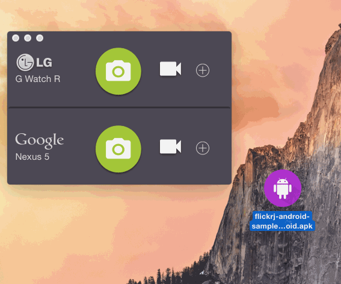
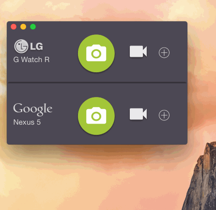
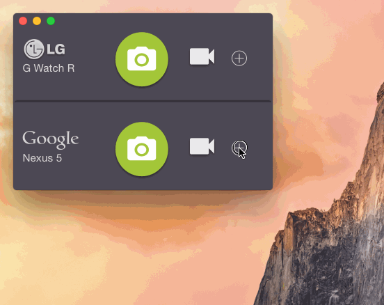

# Android tool for Mac

## Download
**[Download the latest version here](https://github.com/muandrew/androidtool-mac/releases/)**

* Unzip AndroidTool.zip
* Copy AndroidTool.app to your Applications folder
* Right click AndroidTool and choose Open

## What's this? 

Android tool lets you do common Android designer and developer tasks in one click:
* Take screenshots
* Take screen videos
* Install (sideload) APKs without the Play Store
* Take bug reports
* Use common scripts
* Do all of the above on all devices connected to your Mac, in one click

## Recording video

# Requirements
* MacOS 10.9 Mavericks for Android features
* MacOS 10.10 Yosemite for iOS features
* Android 4.4 or newer for screen recording
* Android 4.3 or newer for screenshots (could work on older devices, please report)
* No Android or iOS SDK required (whaat)

Android Tool outputs both mp4 and an animated gif. The animated gif can be placed in a Google Docs document or an email. 

## Installing apps

Double click any APK file on your hard drive and Android Tool pops up asking you onto which device you want to install it. 

## Plain old screenshots

Take screenshots of one or all devices connected to your mac - in one click, or by pressing cmd-shift-S

## Your own scripts

Add your own perfect bash shell scripts to the scripts folder and execute them on a single device, or all devices connected to your Mac. See the example script in the scripts folder how to target a the user-selected device. 

## Questions?
* Open an issue!

## Thanks

### Morten Just
For this project. Find the original project and his contacts [here](https://github.com/mortenjust/androidtool-mac).

### Farhad Khairzad
For the OBB installer script

### adb, fastboot, aapt
The follow binaries are covered under the Apache License, Version 2.0.
* [adb NOTICE](https://android.googlesource.com/platform/system/core.git/+/master/adb/NOTICE)
* fastboot's notice is under the general [android NOTICE](https://android.googlesource.com/platform/system/core.git/+/master/NOTICE)
* [aapt NOTICE](https://android.googlesource.com/platform/frameworks/base.git/+/master/tools/aapt/NOTICE)

### FFmpeg
This software uses code of <a href=http://ffmpeg.org>FFmpeg</a> licensed under the <a href=http://www.gnu.org/licenses/old-licenses/lgpl-2.1.html>LGPLv2.1</a> and its source can be downloaded <a href=https://github.com/FFmpeg/FFmpeg>here</a>

### ImageMagick
   Licensed under the ImageMagick License (the "License"); you may not use
   this file except in compliance with the License.  You may obtain a copy
   of the License at

     http://www.imagemagick.org/script/license.php

   Unless required by applicable law or agreed to in writing, software
   distributed under the License is distributed on an "AS IS" BASIS, WITHOUT
   WARRANTIES OR CONDITIONS OF ANY KIND, either express or implied.  See the
   License for the specific language governing permissions and limitations
   under the License.
